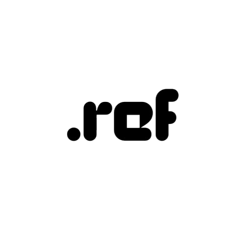

<p align="center">
  
</p>

# ReflexEngine (Work in Progress)  

A **lightweight**, **high-performance** Lua runtime designed for speed, efficiency, and real-time applications.  


[](https://github.com/ReflexEngine/reflex/actions/workflows/release.yml)

## 🚀 What is ReflexEngine?  

ReflexEngine is a modern Lua runtime built from the ground up with **performance** and **efficiency** in mind.  
Whether you're working on **embedded systems, game development, or real-time applications**, Reflex aims to be a fast, minimal, and portable solution.  

Right now, it's still **very early in development**, but the goal is to create a **standalone, zero-dependency** Lua runtime that’s lightweight and **crazy fast**.  

---

## 🔥 Why ReflexEngine?  

✅ **Blazing-Fast Execution** – JIT compilation (planned) for near-native speeds  
✅ **Tiny Memory Footprint** – Optimized to run on systems with as little as **256KB RAM**  
✅ **Standalone** – No external dependencies, just ReflexEngine itself  
✅ **Full Lua 5.4 Support** – Everything you love about Lua, but faster  
✅ **Cross-Platform** – Targeting **Linux, macOS, Windows**

---

## 📦 Installing Dependencies

Before building ReflexEngine, you'll need to install the required dependencies for your platform:

### 🐧 Debian/Ubuntu
```bash
# Install required packages
sudo apt update
sudo apt install -y build-essential gcc make lua5.4 liblua5.4-dev libuv1-dev
```

### 🏹 Arch Linux
```bash
# Install required packages
sudo pacman -S --needed base-devel gcc make lua libuv
```

### ❄️ Alpine Linux
```bash
# Install required packages
sudo apk add build-base gcc make lua5.4-dev
```

### 🍎 macOS
```bash
# Install required packages using Homebrew
brew update
brew install lua libuv gcc make
```

### 🪟 Windows (MSVC)
1. Install Visual Studio with C++ development tools
2. Install Lua development files:
   - Download from https://www.lua.org/download.html
   - Extract to `C:\Program Files\Lua`
3. Add the Lua bin directory to your PATH

### 🪟 Windows (MinGW)
1. Install MSYS2 from https://www.msys2.org/
2. Open MSYS2 shell and run:
```bash
pacman -S mingw-w64-x86_64-toolchain mingw-w64-x86_64-lua
```

### Verifying Installation
After installing dependencies, you can verify them with:
```bash
# Check gcc version
gcc --version

# Check if lua is installed
lua -v  # or lua5.4 -v on some systems
```

## 📌 Development Roadmap  

We’re actively working on getting Reflex up and running. Here’s what’s done and what’s next:  

- [x] **Initial architecture design**  
- [x] **Standard library setup**  
- [ ] **Core runtime implementation** 🚧 *(In progress)*  
- [ ] **JIT compiler development**  
- [ ] **Cross-platform build system**  
- [ ] **Performance benchmarks**  
- [ ] **Documentation**  
- [ ] **First alpha release** 🚀  

---

## 📖 Documentation  

Right now, the project is still in **early development**, but once we have more to show,  
you’ll find detailed documentation in the [Wiki](https://github.com/reflexengine/reflex/wiki).  

---

## ⚡ What Can You Build?  

### 🌍 Lightweight Web Server (Planned)  

```lua
local http = reflex.http.createServer()

http.listen(8080, function ()
    reflex.logger.info("ReflexEngine server started!")
end)
```

> 🚧 *Not implemented yet! Just a preview of what’s planned.*  

---

## 🛠️ Want to Contribute?  

We’re just getting started, and **help is always welcome!**  
If you’re interested in shaping the future of ReflexEngine, check out our [GitHub Issues](https://github.com/reflexengine/reflex/issues).  

---

## 📜 License  

ReflexEngine is open-source and licensed under **MIT**. See [LICENSE](LICENSE) for details.  

---
